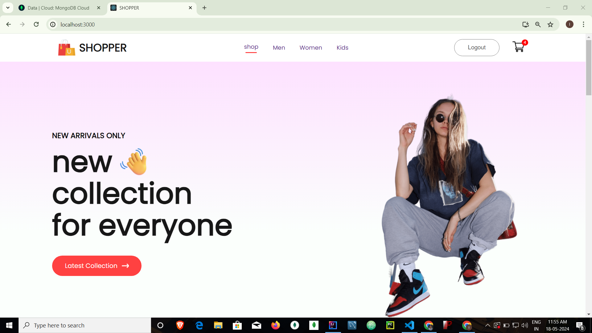
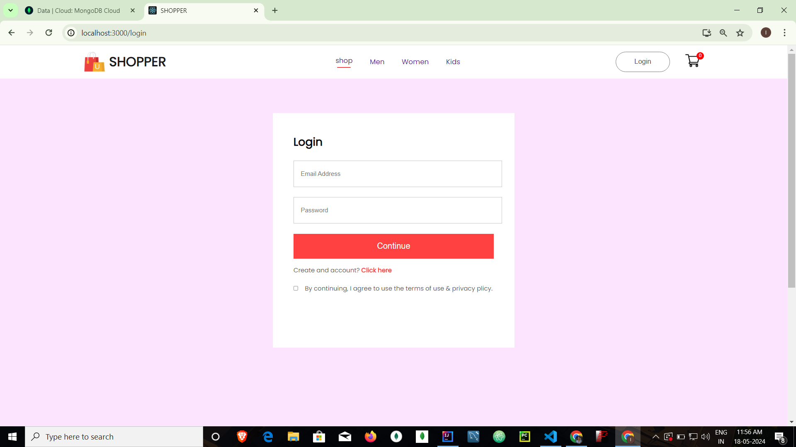
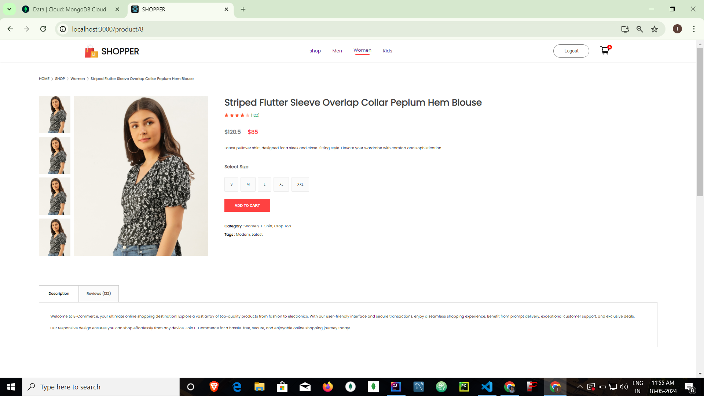
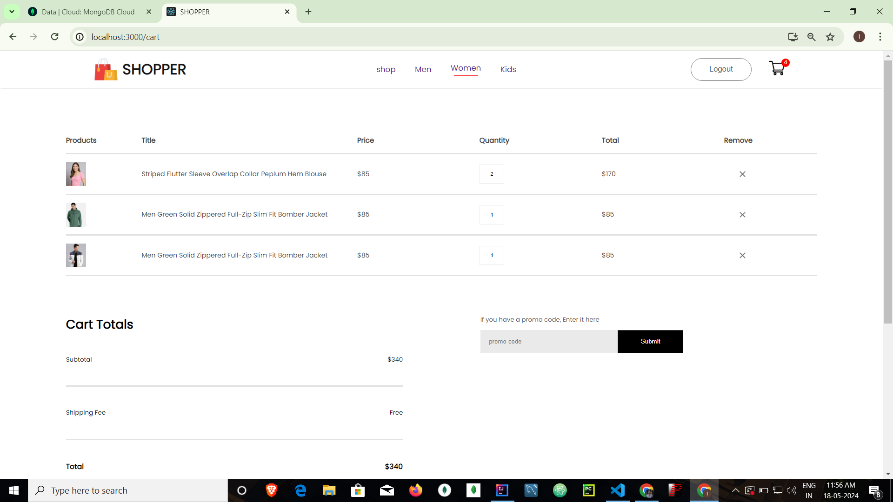
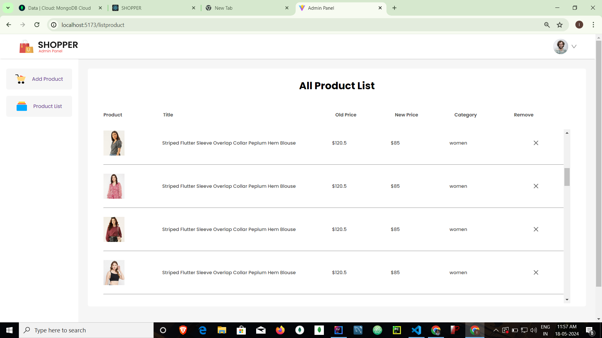
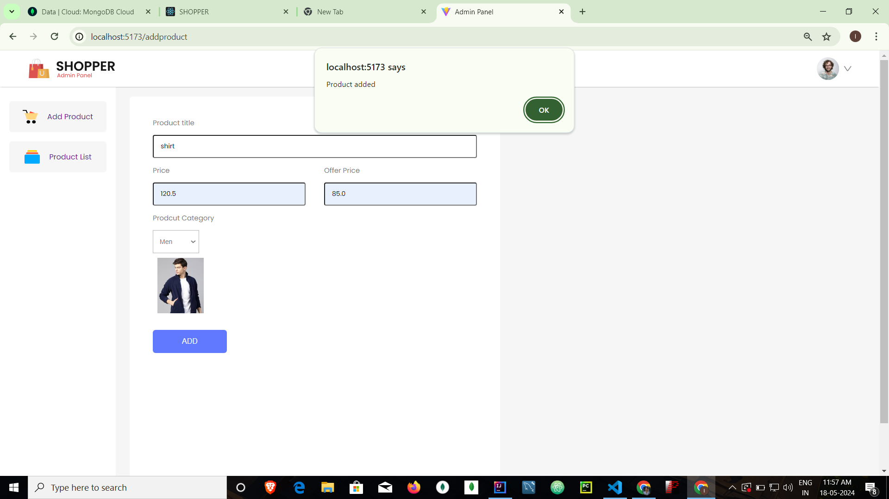

# SHOPPER ( E-commerce web application frontend + backend)

### LIVE [User Panel](https://shop-wine-tau.vercel.app/)
### LIVE [Admin Panel](https://shop-admin-khaki.vercel.app/)

## Introduction
Shopper is a modern e-commerce web application inspired by popular e-commerce websites. Built using the MERN stack (MongoDB, Express, React, and Node.js), it provides both front-end and back-end functionalities to offer a seamless online shopping experience. Shopper is designed for educational purposes and is an incomplete clone without any payment gateway integration. The platform supports a variety of features to facilitate easy browsing,  focusing on demonstrating the architecture and functionality of a typical e-commerce site.

Shopper consists of three main parts:
  * **Front End:** The user interface for browsing products, managing the shopping cart, and user authentication.
  * **Back End:** The server-side application managing the database, handling requests, and providing APIs.
  * **Admin Panel:** An interface for administrators to manage products, categories, and view sales analytics.


## Technologies Used
  * **Frontend:** React, Vite
  * **Backend:** Node.js, Express
  * **Database:** MongoDB (Mongodb Atlas).
  * **Authentication:** JWT (JSON Web Tokens)
## NOTE: 
 * Make sure to install latest version of Node.js, Mongodb, and React.js.
 * Make sure to create account in Mongodb Atlas and Note the password of the cluster. Add Ip address 0.0.0.0 to allow request from any address.
## Features:
### User:
  * Authentication : User have option to sign in or sign up.
  * Navigation : User can navigate to different category by clicking on the options.
  * Product: User can click and get all details about the product.
  * Add to Cart: Products can be added to the cart and clicking on the cart button will display the cart itmes(If user is logged in).

### Admin:
  * Product management: Admin or the product dealer who can add or remove the product if he have authentication.


## Installation:
 -> Follow the below steps
 
  **1.Clone the repository:**
  ```bash
  git clone https://github.com/Tosif145/SHOPPER.git
  cd SHOPPER
  ```

  **2.Install Dependencies:** change directory to the respective section and use the below command.
  ```bash
   npm install
  ```

   **3.Set Up Environment Variables:** add in .env file.  (backend > config > .env )
   ```bash
   MONGODB_URI=mongodb+srv://<name>:<password>@cluster0.lsxrsze.mongodb.net/Ecommerce
   PORT=4000
   ```

   **4.Run the Application:** change directory to the respective section and use the below command in different terminals.
   ```bash
   cd backend
   npm nodemon index.js

   cd frontend
   npm start

   cd Admin
   npm run dev
   ```
   

## Snapshots
### App Frontend: 
  * **Home Page :**
    
      


 *  **SignIn/SignUp:**

      


  *  **Product display:**

      


 *  **Cart Item:**

      


### Admin Panel: 
  * **Admin:**
    
      


 *  **Add product:**

      


